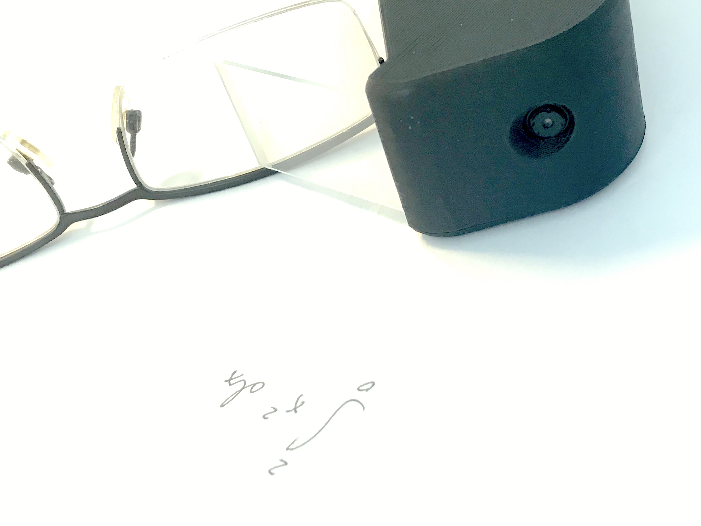
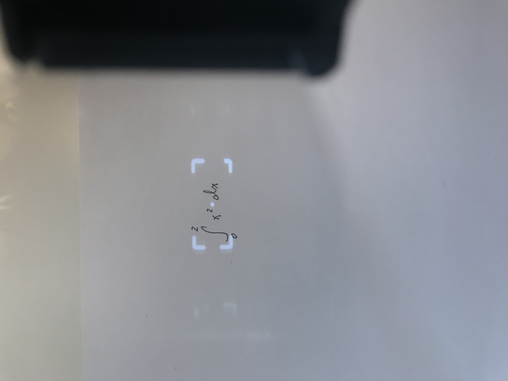
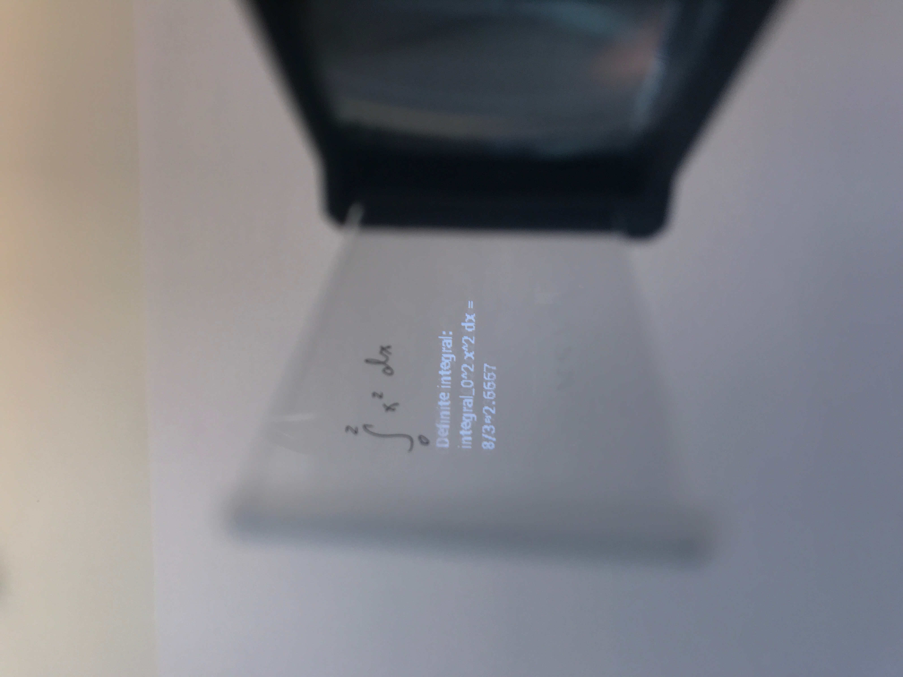

# Maths-solving Smart Glasses

Inspired by a wish from my friend who raced against me doing mental arithmetic, I designed a pair of mathssolving smart glasses based on a Raspberry Pi, which can solve maths problems or define words observed by the user and project the answers in augmented reality.

 

*Archived. 2018 Summer*